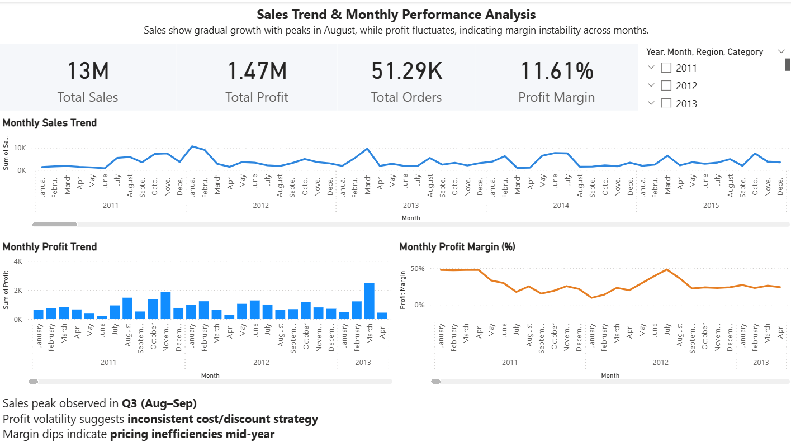
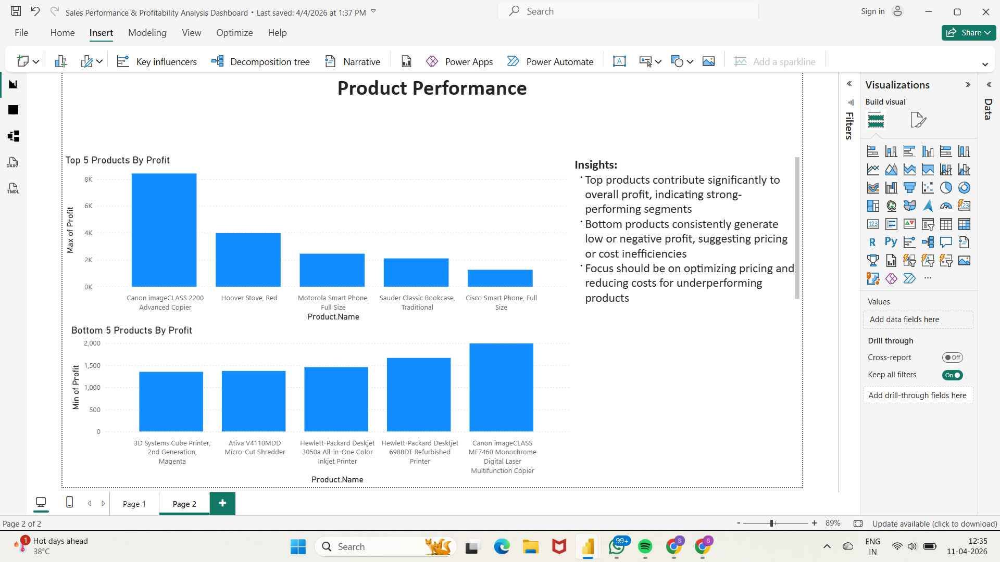

# Sales Performance & Profitability Dashboard

## Executive Summary
This project analyzes 8000+ sales records to evaluate business performance across products, regions, and time.  
It identifies profit gaps, top-performing products, and areas of pricing inefficiency to support data-driven decision-making.

## Problem Statement
Analyze sales data to identify performance trends, profit gaps, and business improvement areas.

## Dataset
- 8000+ records
- Includes sales, profit, category, region, and product-level data

## Tools Used
- Power BI (Data Modeling, DAX)
- Excel

## Key KPIs
- Total Sales
- Total Profit
- Profit Margin

## Analysis Performed
- Monthly sales trend analysis
- Category & region-wise performance
- Top and bottom performing products
- Profitability analysis

## Key Insights
- Identified loss-making products and regions
- Detected margin inefficiencies in specific categories
- Highlighted opportunities for pricing optimization

## Dashboard Preview
### Sales Trend & Performance

- Sales show steady growth with seasonal peaks in Q3.
- Profit margin fluctuation indicates pricing or cost inefficiencies.

### Product Performance Analysis

- A small set of products contributes disproportionately to total profit, indicating concentration risk.
- Bottom products indicate potential pricing or cost issues.

## Business Impact
- Helps identify loss-making products and optimize pricing strategy  
- Enables better decision-making using KPI tracking  
- Supports cost reduction and profit improvement initiatives  

## Skills Demonstrated
- Data Cleaning (Power Query)
- Data Analysis (Excel, DAX)
- Data Visualization (Power BI)
- Business Insight Generation
- KPI Design & Tracking

## How to Use
1. Download the `.pbix` file  
2. Open in Power BI Desktop  
3. Explore dashboard using filters and slicers

## Conclusion
This project demonstrates how data analysis can support business decisions by identifying performance gaps and improving profitability.

## Key Takeaways
- Sales growth is steady but profitability is inconsistent  
- Margin fluctuations indicate pricing or cost inefficiencies  
- Focus on optimizing low-performing products can improve overall profitability  
